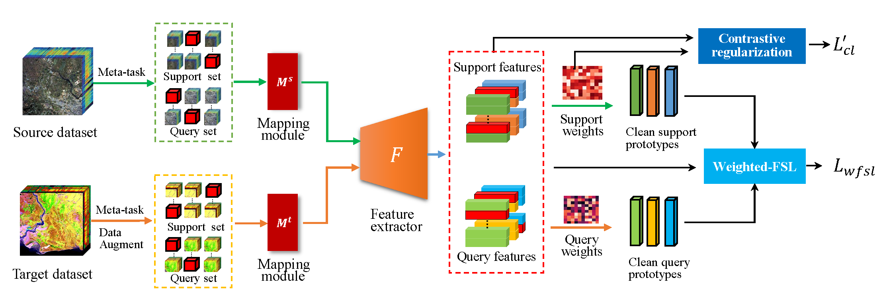

# Weighted Contrastive Prototype Network for Few-Shot Hyperspectral Image Classification With Noisy Labels

Here's the source code for the paper "Weighted Contrastive Prototype Network for Few-Shot Hyperspectral Image Classification With Noisy Labels".

The following is a diagram of the modeling framework of WCPN-FSL.



## Requirements

 - CUDA = 11.0
 - python = 3.8
 - pytorch = 1.7

## Dataset
You can download the hyperspectral image datasets from our disk link [https://pan.baidu.com/s/1rCwFENSSjqOvx8zgGS6LKg?pwd=axie ](https://pan.baidu.com/s/1rCwFENSSjqOvx8zgGS6LKg?pwd=axie), and move the files to `./datasets` folder.

An example dataset folder has the following structure:

```c
datasets
├── Chikusei_imdb_128.pickle
├── IP
│   ├── indian_pines_corrected.mat
│   ├── indian_pines_gt.mat
├── salinas
│   ├── salinas_corrected.mat
│   └── salinas_gt.mat
├── pavia
│   ├── pavia.mat
│   └── pavia_gt.mat
└── paviaU
    ├── paviaU_gt.mat
    └── paviaU.mat
```


## Quick Start

Take WCPN-FSL method on the IP dataset as an example:

 1. Download the required data set and move to folder `./datasets`.
 2. Taking 20% noise rate and $\beta=0.15$ as an example, run `python WCPN-IP.py --noise 0.2 --agg_method cosine --weight_tau True --tau 0.15`
 	where `--noise` denotes the noise rate , you can choose 0, 0.2, 0.4, 0.6；`--agg_method` denotes the aggregation method of the data; `--weight_tau` denotes whether or not to use the weighted contrastive regularization function; `--tau` denotes the value of $\beta$.
 4. If you want to run our ablation experiment,just,set `--weight_tau False`.
